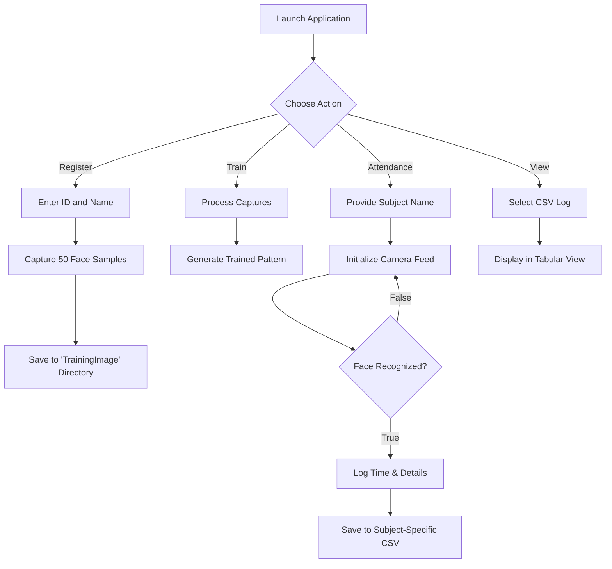
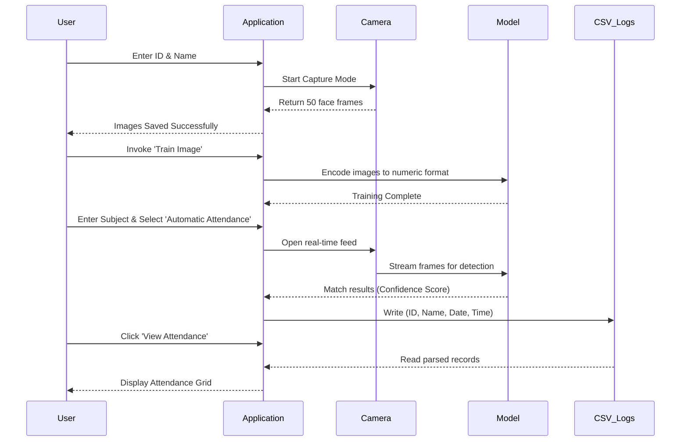

# Face Recognition Attendance System

[](https://www.python.org/downloads/release/python-390/)
[](https://www.python.org/)
[](https://opencv.org/)

A comprehensive Python-based desktop application that streamlines the attendance tracking process using computer vision. This system leverages OpenCV to capture, train, and subsequently recognize faces to mark student attendance automatically.

## Key Features

- **Profile Registration**: Automatically captures multiple samples of a student's face linked to their Unique ID and Name.
- **Model Training**: Processes localized image data to dynamically build a reliable face recognition model using Haarcascade classifiers.
- **Automated Logging**: Identifies registered students via live camera feed and logs their attendance directly to subject-specific CSV files.
- **Data Visualization**: Provides an intuitive tabular interface to view student attendance data instantly without leaving the application.

## System Architecture

The following flowchart outlines the primary operations within the application ecosystem:



## Internal Workflow

This sequence diagram illustrates the interaction between the user interface, the camera module, the Machine Learning component, and data storage.



## Installation and Setup

Follow these instructions to get the project running efficiently on your local machine.

1. **Clone the Repository**
   Download or clone the project repository to your local system environment.

2. **Install Dependencies**
   Navigate to the project root directory and execute the following command to install required Python packages:
   ```bash
   pip install -r requirements.txt
   ```

3. **Directory Configuration**
   Ensure an empty folder named `TrainingImage` exists in the root directory. If not, create it manually to avoid file path errors during image capture.

4. **Environment Variables**
   Open `attendance.py` and `automaticAttendance.py`. Verify and update any system-specific absolute paths if necessary.

5. **Start the Application**
   Run the main script to launch the graphic interface:
   ```bash
   python attendance.py
   ```

## Usage Guidelines

1. **Add a New Student**: Open the application, register a valid ID and Name under the specific entry window, and click `Take Image`. Stay positioned within the camera bounds.
2. **Train the System**: Click `Train Image` after capturing. Do not use the recognition modules until you receive confirmation that the model has successfully trained.
3. **Capture Daily Attendance**: Click `Automatic Attendance`, supply the current subject name, and let the camera scan the room. Recognition logs will dynamically construct a `.csv` database inside the project structure.
4. **View Records**: Use the viewing dashboard to read the respective subject's `.csv` file.

## Screenshots

**Main Interface Module**<br/>


**Image Acquisition Phase**<br/>


**Real-time Recognition and Attendance Logging**<br/>


**Tabular Data Presentation**<br/>

